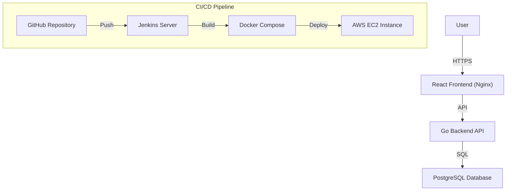

# Full-Stack CI/CD Pipeline: Automated AWS Deployment 🚀
### Showcasing Enterprise-Grade Build & Deploy Infrastructure


This project is a comprehensive demonstration of a **Full-Stack CI/CD Pipeline**, showcasing the automated delivery of a three-tier application (Nexus Messages) from code to production. It leverages Jenkins, Docker, and AWS to provide a robust, scalable, and fully automated deployment environment.

---

## 🏗️ Architecture Overview

The system is built on a modular microservices-inspired architecture, optimized for scalability and automated deployment.



### Key Technical Pillars:
*   **Two-Tier Synchronization**: Real-time data flow between the Go API and partitioned PostgreSQL storage.
*   **Infrastructure as Code**: Automated environment setup using Docker Compose and Jenkins Pipelines.
*   **Cloud Optimized**: Hosted on AWS EC2 with specialized EBS volume management (30GB expansion & Swap optimization).

---

## 🛠️ Tech Stack

### Frontend
- **Framework**: React 18 (Vite)
- **Styling**: Vanilla CSS with Glassmorphism & Cyberpunk aesthetics
- **Deployment**: Nginx (Dockerized)

### Backend
- **Language**: Go (Golang)
- **API**: RESTful Architecture
- **Framework**: Standard `net/http` for high concurrency

### Database & DevOps
- **Database**: PostgreSQL 16
- **Automation**: Jenkins (Declarative Pipelines)
- **Containers**: Docker & Docker Compose
- **Platform**: AWS EC2 (t2.micro / t3.micro)

---

## 🚀 Local Development

### Prerequisites
- Docker & Docker Compose installed

### Steps
1. **Clone the repository**:
   ```bash
   git clone https://github.com/Pratik1603/CI_CD_Pipeline_AWS_Project.git
   cd CI_CD_Pipeline_AWS_Project
   ```

2. **Spin up the stack**:
   ```bash
   docker compose up -d --build
   ```

3. **Access the application**:
   - **Frontend**: `http://localhost:3000`
   - **Backend API**: `http://localhost:3001`

---

## 🛠️ Replicating this Environment (AWS Deployment)

To set up your own automated CI/CD pipeline on AWS, follow these steps:

### 1. AWS EC2 Setup
- **Instance Type**: `t2.micro` or `t3.micro` (Ubuntu 22.04 LTS recommended).
- **Security Groups**: 
  - Allow **SSH (22)** for access.
  - Allow **HTTP (8080)** for Jenkins.
  - Allow **HTTP (3000)** for Frontend.
  - Allow **Custom TCP (3001)** for Backend API.
- **Storage**: Expand EBS volume to **30GB** to accommodate Jenkins builds and Docker images.

### 2. Server Preparation
Connect to your EC2 via SSH and run:
```bash
# Install Docker & Docker Compose
sudo apt-get update
sudo apt-get install -y docker.io docker-compose
sudo systemctl start docker
sudo usermod -aG docker $USER

# Install Jenkins
sudo apt-get install -y fontconfig openjdk-17-jre
sudo wget -O /usr/share/keyrings/jenkins-keyring.asc https://pkg.jenkins.io/debian-stable/jenkins.io-2023.key
echo "deb [signed-by=/usr/share/keyrings/jenkins-keyring.asc] https://pkg.jenkins.io/debian-stable binary/" | sudo tee /etc/apt/sources.list.d/jenkins.list > /dev/null
sudo apt-get update
sudo apt-get install -y jenkins
sudo systemctl start jenkins
```

### 3. Jenkins & Docker Integration
For Jenkins to run Docker commands, add the `jenkins` user to the `docker` group:
```bash
sudo usermod -aG docker jenkins
sudo systemctl restart jenkins
```

### 4. Create Jenkins Pipeline
1. Open Jenkins at `http://YOUR_EC2_IP:8080`.
2. Install the **Pipeline** and **GitHub Integration** plugins.
3. Create a new **Pipeline** job.
4. Under **Pipeline -> Definition**, select **Pipeline script from SCM**.
5. Set SCM to **Git** and use your repository URL.
6. Click **Build Now** to trigger the first deployment.

---

## ☁️ Advanced Optimization
To ensure smooth operation on a `t2.micro` (1GB RAM):
- **Swap Space**: Creating a 2GB Swap file is highly recommended to prevent out-of-memory errors during Docker builds.
  ```bash
  sudo fallocate -l 2G /swapfile
  sudo chmod 600 /swapfile
  sudo mkswap /swapfile
  sudo swapon /swapfile
  ```


## 📈 CI/CD Pipeline
The project uses a `Jenkinsfile` to automate the entire lifecycle:
1.  **Clone**: Pulls the latest code from GitHub on every push.
2.  **Build**: Rebuilds Docker images using `--no-cache` for clean state.
3.  **Deploy**: Performs a zero-downtime restart of containers.
4.  **Integration Tests**: Automatically verifies API health and frontend accessibility before completing the deployment.

---


## 👤 Author
**Pratik**
*   Full-Stack Developer & DevOps Practitioner
*   [GitHub](https://github.com/Pratik1603)
