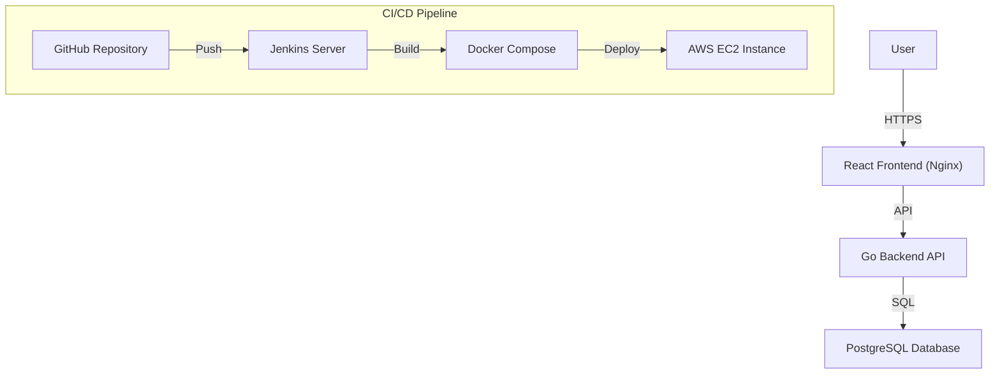

# Nexus Messages 🚀
### Full-Stack Automated Messaging Infrastructure


Nexus Messages is a modern, high-performance three-tier application designed to demonstrate a robust **Full-Stack CI/CD Pipeline**. It features a React frontend, a Go (Golang) backend, and a PostgreSQL database, all orchestrated with Docker and deployed automatically via Jenkins on AWS.

---

## 🏗️ Architecture Overview

The system is built on a modular microservices-inspired architecture, optimized for scalability and automated deployment.



### Key Technical Pillars:
*   **Two-Tier Synchronization**: Real-time data flow between the Go API and partitioned PostgreSQL storage.
*   **Infrastructure as Code**: Automated environment setup using Docker Compose and Jenkins Pipelines.
*   **Cloud Optimized**: Hosted on AWS EC2 with specialized EBS volume management (30GB expansion & Swap optimization).

---

## 🛠️ Tech Stack

### Frontend
- **Framework**: React 18 (Vite)
- **Styling**: Vanilla CSS with Glassmorphism & Cyberpunk aesthetics
- **Deployment**: Nginx (Dockerized)

### Backend
- **Language**: Go (Golang)
- **API**: RESTful Architecture
- **Framework**: Standard `net/http` for high concurrency

### Database & DevOps
- **Database**: PostgreSQL 16
- **Automation**: Jenkins (Declarative Pipelines)
- **Containers**: Docker & Docker Compose
- **Platform**: AWS EC2 (t2.micro / t3.micro)

---

## 🚀 Getting Started

### Prerequisites
- Docker & Docker Compose installed
- Jenkins (if running the CI/CD pipeline)

### Local Development
1. Clone the repository:
   ```bash
   git clone https://github.com/Pratik1603/CI_CD_Pipeline_AWS_Project.git
   cd CI_CD_Pipeline_AWS_Project
   ```

2. Spin up the entire stack:
   ```bash
   docker compose up -d --build
   ```

3. Access the application:
   - **Frontend**: `http://localhost:3000`
   - **Backend API**: `http://localhost:3001`
   - **Database**: `localhost:5432`

---

## 📈 CI/CD Pipeline
The project uses a `Jenkinsfile` to automate the entire lifecycle:
1.  **Clone**: Pulls the latest code from GitHub on every push.
2.  **Build**: Rebuilds Docker images using `--no-cache` for clean state.
3.  **Deploy**: Performs a zero-downtime restart of containers.
4.  **Integration Tests**: Automatically verifies API health and frontend accessibility before completing the deployment.

---

## ☁️ Infrastructure Setup (AWS)
This project is optimized for the **AWS Free Tier**:
- **Volume**: Expanded from 8GB to 30GB for CI/CD headroom.
- **Memory**: Optimized using 2GB Swap space to ensure Jenkins + Docker run smoothly on t2.micro.
- **Security**: Hardened Security Groups for Jenkins (8080) and Web App (3000).

---

## 👤 Author
**Pratik**
*   Full-Stack Developer & DevOps Practitioner
*   [GitHub](https://github.com/Pratik1603)
